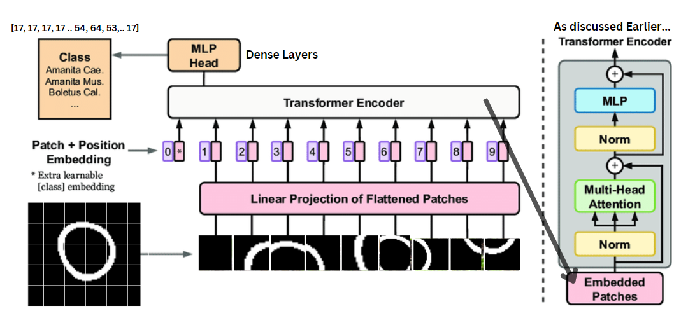

# Hybrid ViT + LSTM for Advanced Cardiac Image Regression in Analysis

## 🚀 Overview

In the rapidly evolving field of cardiac image analysis, traditional methods are being augmented by advanced neural network architectures. Our research introduces a groundbreaking approach by applying the Vision Transformer (ViT) model, originally designed for natural language processing tasks, to the domain of cardiac imaging. This repository contains our implementation of the novel Hybrid ViT + LSTM model aimed at predicting Target Organ Status (TOS) values from myocardium mask image sequences.

[Download the Checkpoints](https://drive.google.com/your_shareable_link_here)


<div style="text-align:center;">
    
</div>
<div style="text-align:center;">
    
</div>


*Figure 1: Hybrid ViT + LSTM Model Architecture*

## 🌟 Key Features

- **Innovative Application of ViT**: Adapting the Vision Transformer model to analyze cardiac image sequences.
- **Hybrid Architectures**: Implementation of ViT+Dense and ViT+LSTM models.
- **Enhanced Temporal Analysis**: ViT+LSTM model's ability to capture complex temporal dependencies in image sequences.
- **State-of-the-Art Performance**: Achieved a Mean Absolute Error (MAE) of 8.1491 on test data, surpassing other models.


## 📊 Benchmark Results

We're pushing the boundaries with our models:

- **ViT+LSTM**: MAE = 8.1491 🏆
- **ViT+Dense**: MAE = 8.213
- **3DCNN**: MAE = 8.5879

These results underscore the ViT+LSTM model's prowess, offering a glimpse into the future of medical diagnostics.

## 📁 Repository Structure

- `vit_lstm_model/`: Implementation heartland of the ViT+LSTM model.
- `data/`: Sample data - the beginning of your journey.
- `notebooks/`: Interactive Jupyter notebooks - your guide to understanding our model.
- `results/`: Dive into our comprehensive evaluation results and analyses.

## 🚶 Getting Started

Embark on your journey with these simple steps:

1. **Clone the Repository**
   ```bash
   gh repo clone rugved88/Hybrid-Vision-Transformer

2. [Download the Checkpoints](https://drive.google.com/your_shareable_link_here)


Authors: Rugved Chavan, Naeem Patel, Rishabh Jain, Ishita Gupta

