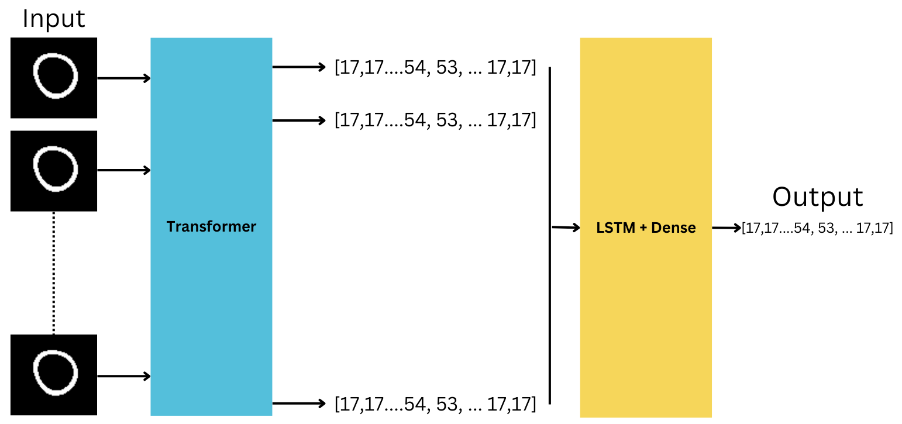

# Hybrid ViT + LSTM for Advanced Cardiac Image Regression in Analysis

## 🚀 Overview

In the rapidly evolving field of cardiac image analysis, traditional methods are being augmented by Convolutional Neural Network architectures.  Our research introduces a groundbreaking approach by applying the Hybrid Vision Transformer (ViT) model, to the domain of cardiac imaging. Transformers originally designed for natural language processing tasks are now giving promosing results on the image regression task. This repository contains our implementation of the novel Hybrid ViT + LSTM model aimed at predicting Time to the onset of circumferential shortening (TOS) values from myocardium mask image sequences.

## 📸 Dataset Info
The dataset integral to our research comprises two key components: Myocardium Masks and Time to the onset of circumferential shortening (ToS) ground truth data as shown in figure \ref{fig:dataset}. The Myocardium Masks image dataset consists of data from 128 patients. For each patient, there is a sequence of 25 frames, with each frame having a resolution of 80x80 pixels. This forms a data structure with a shape of (128, 80, 80, 25), indicating that the dataset includes 128 patients, each represented by a series of 25 images with a resolution of 80x80 pixels. These images provide a comprehensive view of myocardial structure and function over time, essential for analyzing cardiac health and pathology.

Complementing the image data, the ToS ground truth component consists of a one-dimensional array containing 126 data points for each patient. This results in a data shape of (128, 126), representing the 128 patients and their corresponding 126 ToS values. The ToS data is crucial for our study as it provides the target values for the predictive modeling, enabling the evaluation of the model's accuracy in predicting clinically relevant outcomes.


<div style="text-align:center;">
    
</div>
<div style="text-align:center;">
    
</div>


*Figure 1: Hybrid ViT + LSTM Model Architecture*

## 🌟 Key Features

- **Innovative Application of ViT**: Adapting the Vision Transformer model to analyze cardiac image sequences.
- **Hybrid Architectures**: Implementation of ViT+Dense and ViT+LSTM models.
- **Enhanced Temporal Analysis**: ViT+LSTM model's ability to capture complex temporal dependencies in image sequences.
- **State-of-the-Art Performance**: Achieved a Mean Absolute Error (MAE) of 8.1491 on test data, surpassing other models.


## 📊 Benchmark Results

We're pushing the boundaries with our models:

- **ViT+LSTM**: MAE = 8.1491 🏆
- **ViT+Dense**: MAE = 8.213
- **3DCNN**: MAE = 8.5879

These results underscore the ViT+LSTM model's prowess, offering a glimpse into the future of medical diagnostics.

## 📁 Repository Structure

- `codes/`: Implementation heartland of the 3D_CNN ,ViT+LSTM model.
- `dataset/`: contains the dataset.

## 🚶 Getting Started

Embark on your journey with these simple steps:

1. **Clone the Repository**
   ```bash
   gh repo clone rugved88/Hybrid-Vision-Transformer

2. [Download the Checkpoints](https://drive.google.com/file/d/1fBz7bSd58DL6DF55DreUcDWrv28V5_W_/view?usp=sharing)


Authors: Rugved Chavan, Naeem Patel, Rishabh Jain, Ishita Gupta

